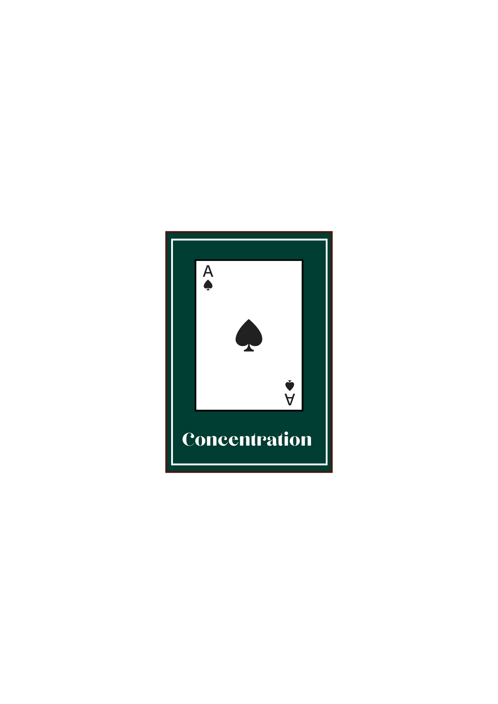

# Concentration
[Concentration](https://en.wikipedia.org/wiki/Concentration_(card_game)) is a type of card-based memory game. All card aficianados (myself included) have played some variant of this at one time or another; and this particular variant is a simplified version of the classic 52-card game, taking 10 cards (5 pairs) for simplicity's sake. 

I assume there aren't as many people eager to memorize the position of 52 cards! (hint: this may be something I add later)

# Getting Started
[Play here!](https://khalilkhunji.github.io/Concentration/)

All instructions on how to play the game are contained therein; but note that you can only reset and start a new game once a game is already finished (or simply refresh the page).

Here's the initial [plan](https://github.com/KhalilKhunji/concentration/blob/main/PLAN.md) if interested.

# Attributions
* Logo courtesy of Maryam Ali.
* Card assets (mostly CSS, with some Javascript) taken from General Assembly [card game starter](https://github.com/SEB-10-Bahrain/card-game-starter).

# Technologies Used
This game was coded using HTML, CSS and Javascript.

# Next Steps
As originally mentioned in the [plan](https://github.com/KhalilKhunji/concentration/blob/main/PLAN.md), here are some improvements that will likely be implemented in the future:

1. Customizable Difficulty: Adjustable scale bar that the user can interact with to change the number of randomized pairs, amount of memorization/matching time, and number of attempts.

2. Option for more than the standard 52 card deck size (such as including jokers, duplicate pairs, special rules, etc.)